- when open folder, traverse and run blake3 on everything 
- eventually get this working with fuse?
- topologically sort the tags and use that + hard links to make this work with a hierarchical fs?
- if we use Snowflake IDs instead of UUIDs, we can use them as inode values
- tag uuids can be stored in xattrs
```rust
struct AttributeValuePair {
 Attribute,
 Value
}
// label
struct Attribute {
GUID,
Type: AttributeType
}
enum AttributeType {
 FS,// FS Path
 String, // String
 Enum
}
// Content
enum Value {
Attribute: Attribute,
File: File,

}
```
# FUSE API
- getattr
- readdir
- open
- read
# Todo
- iterate through a hardcoded folder
- generate FS tags

# issues 
- how do we keep track of files (ie update our state to match the underlying FS especially when we're not running)
  - FS path?
	  - gets fucked up when file is moved or renamed
  - hash?
	  - gets fucked up when file is modified
	  - what happens if you have a copy of a file and modify one 
  - inode? 
	  - are inodes stable?
	  - what causes one to change?
  - I assume we can't just watch the whole fs for changes while running

```mermaid
classDiagram

namespace basefs {

class Home

class Media

class Projects

class untitled_xcf["untitled.xcf"]

class root["root node"]

}

namespace tagfs {

class _Home["Home"]

class _Media["Media"]

class _Projects["Projects"]

class _root["root node"]

class _shitpost["shitpost"]

class _unfinished["unfinished"]

class _untitled_xcf["untitled.xcf"]

}

Home *-- Media

Home *-- Projects

Home: xattr tagfs.tags = [_Home.uuid]

Media: xattr tagfs.tags = [_Projects.uuid]

Projects *-- untitled_xcf

Projects: xattr tagfs.tags = [_Projects.uuid]

root *-- Home

root .. _root

untitled_xcf: xattr tagfs.tags = [_unfinished.uuid, _shitpost.uuid]

  

_Home *-- _Media

_Home *-- _Projects

_Home ..|> Home

_Home : Uuid inode

_Home : xattr tagfs.basefs_path=/Home/

_Home : xattr tagfs.type=fs_dir

_Media ..|> Media

_Media: Uuid inode

_Media : xattr tagfs.basefs_path=/Home/Media

_Media : xattr tagfs.type=fs_dir

_Projects *-- _unfinished

_Projects *-- _untitled_xcf

_Projects ..|> Projects

_Projects : Uuid inode

_Projects : xattr tagfs.basefs_path=/Home/Projects

_Projects : xattr tagfs.type=fs_dir

_root *-- _Home

_root *-- _shitpost

_root *-- _unfinished

_shitpost *-- _untitled_xcf

_shitpost : Uuid inode

_shitpost : xattr tagfs.type=tag

_unfinished *-- _untitled_xcf

_unfinished : Uuid inode

_unfinished : xattr tagfs.type=tag

_untitled_xcf ..|>"passthrough i/o calls" untitled_xcf

_untitled_xcf : Uuid inode

_untitled_xcf : xattr tagfs.basefs_path=/Home/media/untitled_xcf

_untitled_xcf : xattr tagfs.type=fs_file

  

style Home fill:#2b242e

style Media fill:#2b242e

style Projects fill:#2b242e

style _Home fill:#8E44AD

style _Media fill:#8E44AD

style _Projects fill:#8E44AD

style _root fill:#C0392B

style _shitpost fill:#A0522D

style _unfinished fill:#A0522D

style _untitled_xcf fill:#2980B9

style root fill:#402a28

style untitled_xcf fill:#24323b
```

